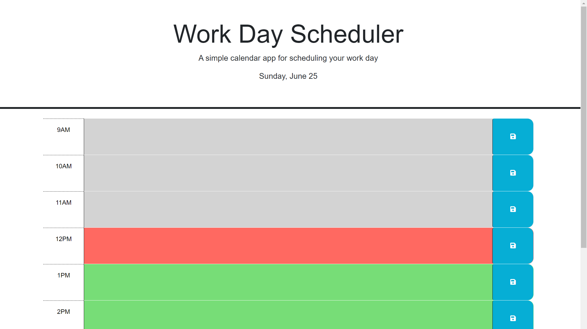

# 05_Daily_Planner

## Description
- What was your motivation?
My motivation for this project was to build a simple event planner that would allow me to input my daily schedule into a set of color-coded timeblocks and permanently save those events so I could return to them later.

- Why did you build this project? 
^

- What problem does it solve?
^

- What did you learn?
I learnt about utilising Dayjs methods, and furthered my knowledge of jQuery.

## Installation

Navigate to github repo at https://github.com/J-D-garwood/05_Daily_Planner. Download all files (index.html, assets folder w/ css and js)

## Credits

No collaborators on this project

## License

N/a

## link to deploayed application
https://j-d-garwood.github.io/05_Daily_Planner/

## Image of deployed application

